# SyncPoint

> **Group Contribution & Task Manager**

SyncPoint is a desktop application built using **C# WinForms** that helps groups and teams manage tasks, track individual contributions, and monitor overall team progress in one centralized system.

The project aims to solve common problems in group work such as lack of transparency, poor task organization, and uneven contribution distribution. Instead of relying on scattered messages or separate to-do lists, SyncPoint provides a structured environment where every member can stay updated and accountable.

Whether for school projects, capstones, or collaborative activities, SyncPoint helps teams stay organized and productive.

---

# Key Features

* **Role-Based Dashboards:** Specialized interfaces for Instructors (management), Leaders (assignment), and Members (execution).
* **Dynamic Task Marketplace:** Members can browse and claim \"Available Tasks,\" ensuring a fair and transparent workload distribution.
* **Automated Scoring Engine:** Real-time point calculation featuring **automatic late submission penalties** calculated at the database level.
* **Concurrency Control:** Integrated \"Busy Gate\" logic prevents task hoarding, requiring members to finish or submit current work before claiming new tasks.
* **Live Analytics:** Instant generation of Leaderboards, Task Distribution charts, and Member Progress reports.

---
# Object-Oriented Programming Principles Used

## 1. Abstraction
Examples:
- `ValidateLogin()`
- `GetTasksByMember()`
- `CreateTask()`
- `RegisterUser()`

Complex database and validation logic are hidden behind reusable methods.

---

## 2. Encapsulation
Examples:
- `Session` class stores logged-in user data securely
- Database access handled through `DatabaseHelper`
- Config file handling hidden inside setup methods

---

## 3. Inheritance
Examples:
- All forms inherit from `Form`
- `SidebarControl` inherits from `UserControl`
- Shared WinForms lifecycle functionality

---

## 4. Polymorphism
Examples:
- `OpenDashboard(role)`
- Dynamic UI styling using `CellFormatting`
- Sidebar active-state switching

---

# System Architecture

```mermaid
classDiagram
    direction TB

    class Session {
        <<static>>
        +int UserID
        +int GroupID
        +string FullName
        +string RoleName
        +Clear()
    }

    class DatabaseHelper {
        <<static>>
        +GetConnection() SQLiteConnection
        +ValidateLogin(string, string) DataRow
        +RegisterUser(string, string, string) bool
        
        %% Instructor Logic
        +AppointLeader(int, int) void
        +GetScoresByGroup(int) DataTable
        +GetAllGroups() DataTable
        
        %% Leader Logic
        +CreateTask(int, string, string, DateTime, int?, int) int
        +GetPendingSubmissions(int) DataTable
        +ApproveTask(int, int, int) bool
        +ReturnTaskToMember(int) bool
        
        %% Member Logic
        +GetAvailableTasks(int) DataTable
        +GetTasksByMember(int) DataTable
        +AssignAndAcceptTask(int, int) bool
        +SubmitTask(int, string) bool
    }

    %% --- THE USER INTERFACE LAYER ---

    class InstructorDashboardForm {
        <<form>>
        -LoadGroupManagementGrid()
        -btnAppointLeader_Click()
        -LoadReportsTab()
    }

    class LeaderDashboardForm {
        <<form>>
        -LoadGroupTasksGrid()
        -LoadPendingSubmissionsGrid()
        -btnApprove_Click()
        -btnReject_Click()
        -btnCreateNewTask_Click() (opens AddTaskForm)
    }

    class MemberDashboardForm {
        <<form>>
        -LoadDashboardStats()
        -LoadMyTasks()
        -btnSubmitTask_Click()
        -lblMarketplace_Click() (opens TasksForm)
    }

    class TasksForm {
        <<form>>
        -LoadAvailableTasks()
        -dgvTasks_CellContentClick() (triggers AssignAndAcceptTask)
    }

    class AddTaskForm {
        <<form>>
        -btnAssignTask_Click()
    }

    InstructorDashboardForm ..> DatabaseHelper : calls
    LeaderDashboardForm ..> DatabaseHelper : calls
    MemberDashboardForm ..> DatabaseHelper : calls
    TasksForm ..> DatabaseHelper : calls
    AddTaskForm ..> DatabaseHelper : calls
    
    InstructorDashboardForm --> Session : reads state
    LeaderDashboardForm --> Session : reads state
    MemberDashboardForm --> Session : reads state
    TasksForm --> Session : reads state
    
    LeaderDashboardForm ..> AddTaskForm : navigation
    MemberDashboardForm ..> TasksForm : navigation

```



---

# Technologies Used

* **Language:** C# (.NET Framework)
* **UI Framework:** Windows Forms (WinForms)
* **Database:** SQLite (Relational Database Management)
* **Architecture:** Layered Logic (Data Access via DatabaseHelper, UI via Dashboard Forms)
* **Security**: SHA-256 Password Hashing
* **IDE:** Visual Studio 2022

---

# How to Run the Application

## Requirements
- Windows 10 or 11
- Visual Studio 2022
- .NET Framework 4.8 or .NET 6+
- SQL Server or SQLite

---

# Installation Steps

## 1. Clone the Repository

```bash
git clone https://github.com/minillyy/SyncPoint.git
```

## 2. Open the Solution
- Launch Visual Studio 2022
- Open `SyncPoint.slnx`

## 3. Run the Application

```text
F5
```

or

```text
Ctrl + F5
```

On first launch, the Setup screen will appear.

---

# How to Use

SyncPoint is designed around a three-tier hierarchy to ensure structured project management.

### For Instructors (Project Administrators)
* **Manage Groups:** Create project groups and batch-register students.
* **Appoint Leaders:** Designate high-performing members as "Leaders" to delegate task management within a group.
* **Global Analytics:** Access the `Reports` tab to monitor group-wide velocity, completion rates, and historical data.

### For Leaders (Task Managers)
* **Task Assignment:** Create tasks with specific titles, descriptions, and deadlines. 
* **Weight Selection:** Assign point values (1, 3, or 5) based on the difficulty of the work.
* **Quality Control:** Access the `Pending Review` queue to inspect submitted links. You can either `Approve` (which triggers the automated scoring) or `Return` work for revision.

### For Members (Execution)
* **The Marketplace:** Browse the `Available Tasks` store. Note: You can only see tasks that are unassigned and still 'Pending'.
* **Claiming Work:** Click 'Accept' to move a task to your workspace. The system enforces a **"Single-Task Rule"** where you must submit or finish your current task before claiming a new one.
* **Submissions:** Provide a live link to your work (GitHub, Google Drive, etc.). The system automatically timestamps your submission for deadline verification.
* **Live Leaderboard:** Track your points and rank against other group members in real-time.

---

# Developers

| Name | Role |
|---|---|
| Dapoc, Romelie Joy M. | GUI Developer |
| Lozada, Chester | Logic Developer |
| Villegas, Lemuel | Project Manager |

---

# License

This project is for educational purposes only.

---

# Acknowledgement
We would like to express our deepest gratitude to our instructor, Ma'am Darlene for her invaluable guidance and technical insights throughout the development of SyncPoint. Her feedbacks were instrumental in refining the system’s logic, particularly the automated scoring and concurrency features.

---

# SyncPoint Philosophy

> *"A group that tracks together, stays on track together."*
